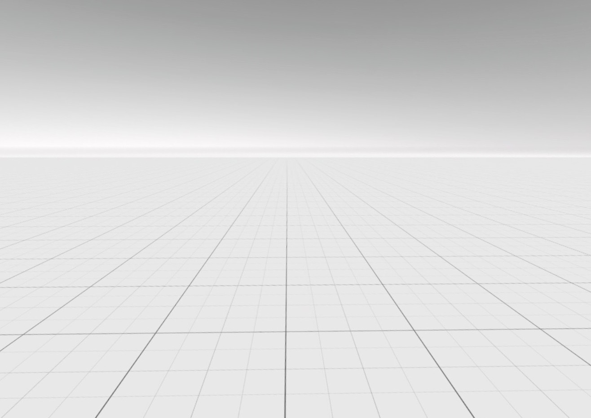

# vr-oculus-unity-minimal

A minimal VR application for the Oculus Quest 2.

* Based on the [Unity VR template](https://docs.unity3d.com/2019.4/Documentation/Manual/xr-template-vr.html)
* Unity environment and project configuration from the [Oculus developer guide](https://developer.oculus.com/documentation/unity/unity-gs-overview/)
* Appropriate [.gitignore](https://github.com/github/gitignore/blob/main/Unity.gitignore)

